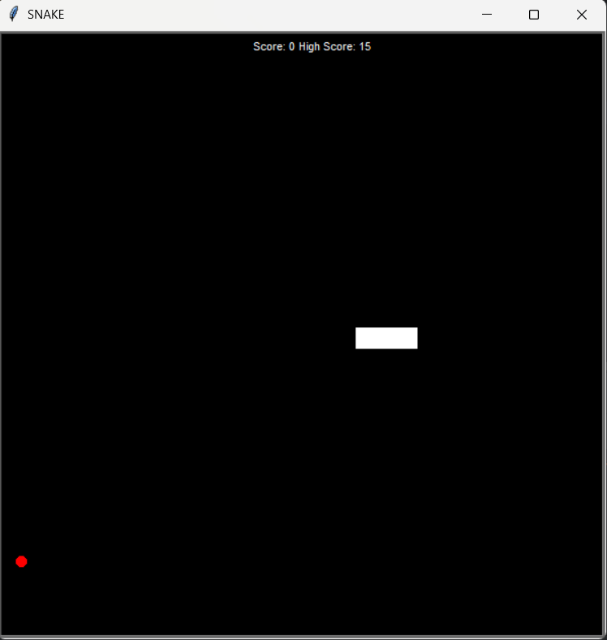

# SnakeGame

This is a classic Snake game built with Python’s `turtle` graphics module.  
The player controls a snake that moves around the screen, eats food to grow longer, and earns points.  
The goal is to score as many points as possible without hitting the walls or the snake’s own tail.

## Installation guide

This project requires no external dependencies.  
It runs entirely with Python’s standard library.

1. Make sure you have **Python 3.6 or higher** installed.  
2. Download the **SnakeGame** project.  
3. Open a terminal (or command prompt) and navigate to the project folder.  
4. Run the script: `python .\snakegame\main.py`

## Usage guide

After launching the script, a black window will appear with the game title **SNAKE** at the top.  
Use the arrow keys on your keyboard to control the snake’s movement:  
**Up**, **Down**, **Left**, and **Right**.

When the snake eats food, it grows in length and your score increases.  
The game automatically resets if the snake hits the wall or collides with its own tail.

## License

This project is licensed under the **MIT License** — see the LICENSE file for details.
